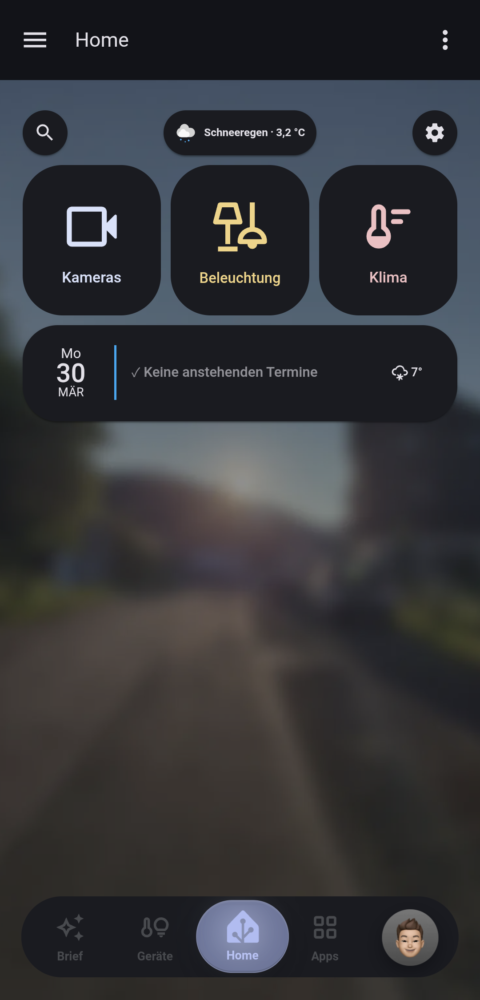
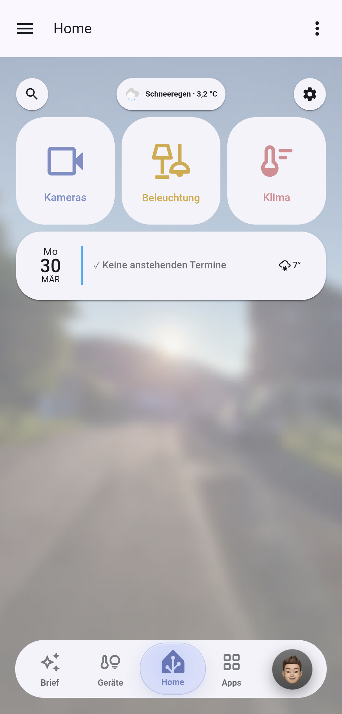
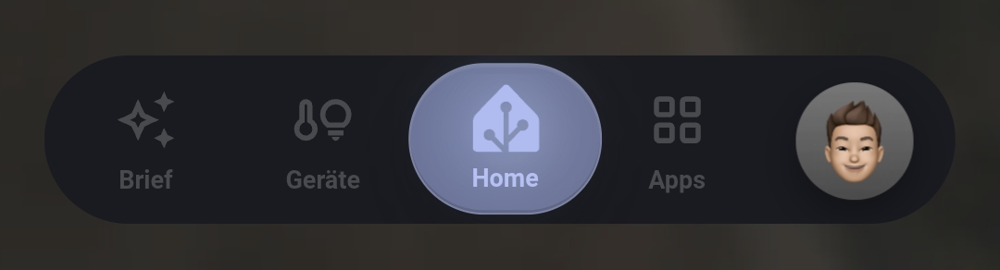
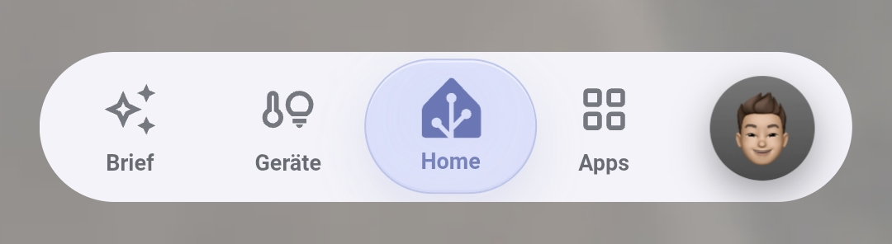
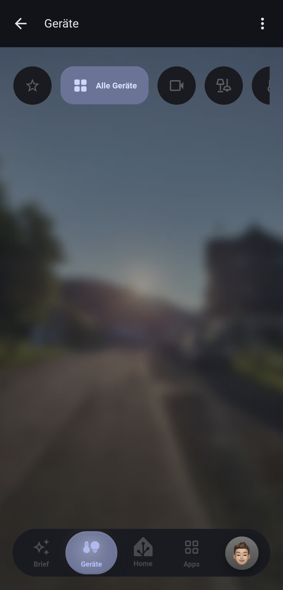
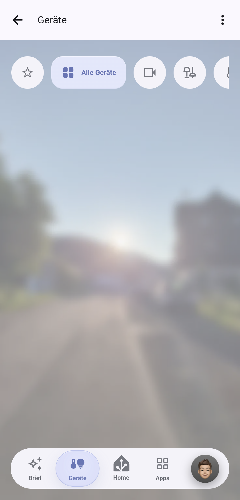
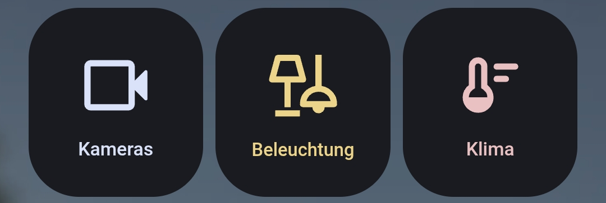
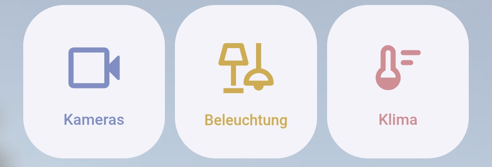

  
  <h1 align="center">HAOS Material You Dock</h1>
  

    Modernes Home Assistant UI im Material You Stil mit Bottom Dock, Swipe Tabs und Feature Cards.
  

  
  
  
  

---

## Überblick

**HAOS Material You Dock** ist ein modernes, mobiles Dashboard-UI für Home Assistant.  
Das Projekt enthält wiederverwendbare YAML-Komponenten für:

- Bottom Dock Navigation
- Swipe Tabs / Filterleisten
- Feature Cards

Optimiert für **Dark Mode** und **Light Mode**.

---

## Vorschau

### Dashboard

| Dark Mode | Light Mode |
|---|---|
|  |  |

---

## Komponenten

## Bottom Dock Navigation

| Dark | Light |
|---|---|
|  |  |

Fixierte Navigation am unteren Bildschirmrand mit aktiven Zuständen, Animationen und Theme-Anpassung.

### Datei
`01-bottom-dock.yaml`

### Anpassbar
- `navigation_path`
- Icons
- Labels
- optionale Profil-/Avatar-Quelle

---

## Swipe Tabs

| Dark | Light |
|---|---|
|  |  |

Horizontale Tab-Leiste mit dynamischen Pills und Swipe-Verhalten.

### Datei
`02-swipe-tabs.yaml`

### Anpassbar
- aktive Helper-Entity
- Tab-Namen
- Icons
- Optionen / Zustände

---

## Feature Cards

| Dark | Light |
|---|---|
|  |  |

Material-inspirierte Schnellzugriffskarten für wichtige Dashboard-Bereiche.

### Datei
`03-feature-cards.yaml`

### Anpassbar
- `navigation_path`
- Icons
- Farben
- Beschriftungen

---

## Features

- Material You inspirierter Look
- Dark / Light Mode Support
- Flüssige Animationen
- Mobile optimiert
- Wiederverwendbare YAML-Komponenten
- Einfache Anpassung an eigene Dashboards

---

## Voraussetzungen

- Home Assistant
- `button-card`
- `card-mod`
- `swipe-card`

**Empfohlen:**
- Material You Theme oder eigenes angepasstes Theme

---

## Installation

1. YAML-Dateien in dein Dashboard übernehmen
2. Eigene Entitäten und `navigation_path` anpassen
3. Optional Theme aktivieren
4. Fertig

---

## Dateien

- `01-bottom-dock.yaml` → Bottom Navigation
- `02-swipe-tabs.yaml` → Tabs / Filterleiste
- `03-feature-cards.yaml` → UI Karten

---

## Hinweise

Die verwendeten Navigationen wie z. B. `#cameras`, `#lighting` oder `#climate` sind Platzhalter und müssen an dein eigenes Dashboard angepasst werden.

---

## Lizenz

MIT License
